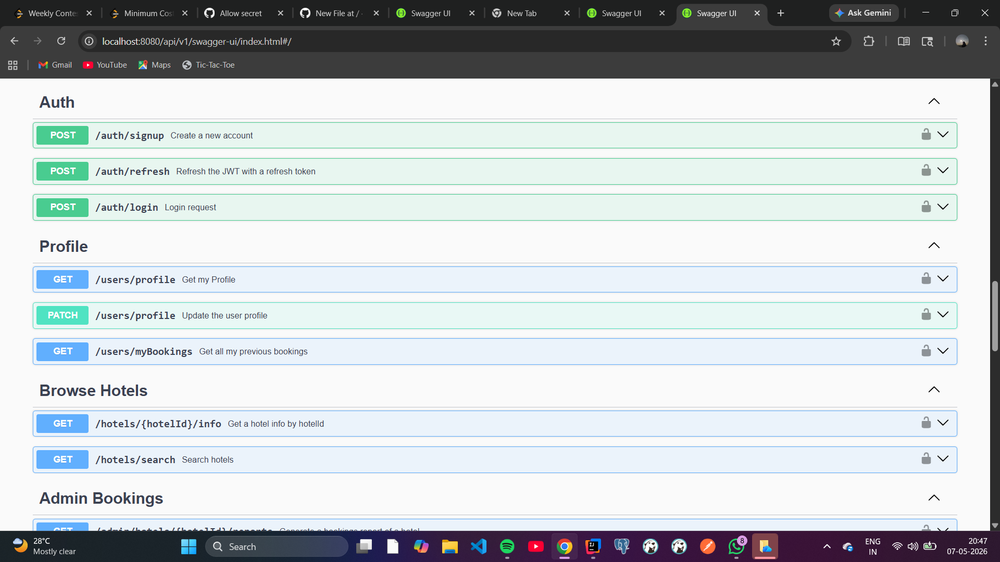
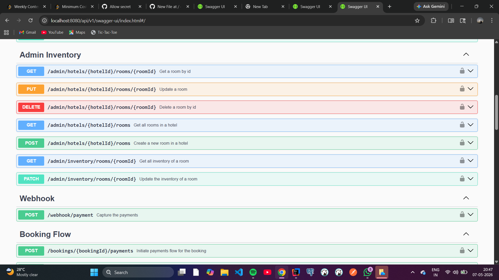
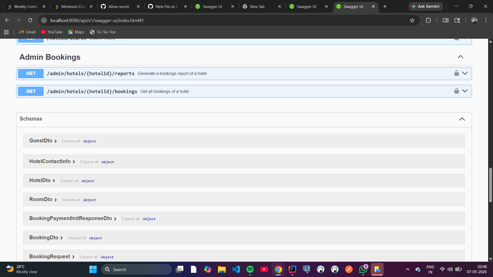

# Airbnb Backend Clone (Spring Boot)

A production-ready RESTful API for a property booking platform. This project showcases a robust backend architecture built with **Spring Boot 3**, featuring secure user authentication, complex relational data modeling, and third-party payment integration.

## 🚀 Key Technical Features
* **Secure Authentication:** Implemented stateless security using **JWT (JSON Web Tokens)** and **Spring Security**.
* **Payment Integration:** Integrated **Stripe API** for secure transaction handling and payment intent workflows.
* **Database Management:** Leveraged **PostgreSQL** and **Hibernate (JPA)** for efficient data persistence and relational mapping.
* **Automated Documentation:** Integrated **Swagger UI / OpenAPI 3.0** for interactive API testing and documentation.
* **Security Best Practices:** Secured sensitive credentials (API keys, DB passwords) using system environment variables.

## 🛠️ Tech Stack
* **Language:** Java 17+
* **Framework:** Spring Boot 3.x
* **Security:** Spring Security, JWT
* **Database:** PostgreSQL
* **API Documentation:** Swagger UI
* **Payments:** Stripe SDK
* **Build Tool:** Maven

---

## 📸 API Documentation & Interactive Demo
I have utilized Swagger UI to provide a comprehensive and interactive dashboard for testing all backend endpoints.

### 🔐 Authentication & Profile Management
The system handles secure signups, logins, and JWT token refreshing.


### 🏨 Hotel & Inventory Management
Admin endpoints for managing hotels, room types, and inventory levels.


### 📅 Booking Flow & Payments
Comprehensive booking lifecycle, from initiation to Stripe payment capture via webhooks.


---

## 🗄️ Database Design
The relational schema is designed for high data integrity:
* **Users & Profiles:** Managed with distinct roles for guests and admins.
* **Hotels & Rooms:** Hierarchical relationship ensuring availability is tracked per room type.
* **Bookings:** Tracks the relationship between users and property inventory with payment status states.

## ⚙️ Local Setup
1. **Clone the repository:**
   ```bash
   git clone [https://github.com/123NUTAN/airbnb-backend-clone.git](https://github.com/123NUTAN/airbnb-backend-clone.git)

2. Set Environment Variables:
   Configure DB_PASSWORD, JWT_SECRET_KEY, and STRIPE_SECRET_KEY in your environment.
   
3. Run the application:
   ./mvnw spring-boot:run

4. Access Swagger UI:
  Navigate to
 http://localhost:8080/swagger-ui/index.html
to explore the API.


